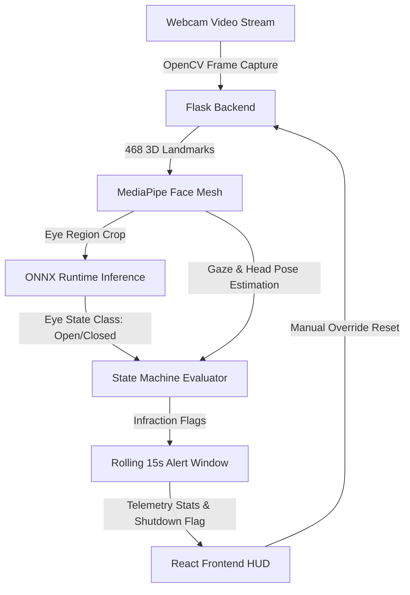

# Driver Safety AI: Real-Time Driver Monitoring System (ADAS) 🚗👁️

[](https://www.python.org/)
[](https://flask.palletsprojects.com/)
[](https://react.dev/)
[](https://mediapipe.dev/)
[](https://onnxruntime.ai/)

Driver Safety AI is a high-performance, edge-AI computer vision system designed to prevent road accidents in real time. Running entirely on local hardware (Edge-AI) for low latency and privacy, the system monitors driver behavior through a webcam to detect drowsiness, distraction, and unsafe head positions.

If the system detects high-risk behavior, it triggers instant visual and audio alarms. When multiple safety infractions occur in quick succession, it initiates a simulated **Emergency Engine Shutdown** to secure the vehicle, requiring a manual system override to restart.

---

## 🚀 System Architecture & Pipeline

The system operates in a real-time frame processing pipeline running under **30ms**:



1. **Capture (Input):** OpenCV captures live video frames from the webcam.
2. **AI Processing Pipeline (Backend):**
   - **MediaPipe Face Mesh:** Tracks 468 points on the face to extract eye contours, iris movement (Gaze), and head pose (Turn/Vertical ratios).
   - **ONNX Runtime Classifier:** Runs inference on eye-region crops using a custom CNN-based eye-state classification model (validation accuracy of **~98%**) to confirm drowsiness.
   - **State Machine & Sliding Window:** Aggregates telemetry stats. If an alert is triggered (drowsy, phone, side-eye), it registers the event in a **rolling 15-second window**.
3. **Telemetry & HUD Action (Frontend):**
   - A **React.js Dashboard** polls telemetry data every 200ms using **Axios**.
   - Handles real-time HUD rendering, visual warning highlights (turns neon-red), and triggers the **HTML5 Audio API** to sound a loud alarm.
   - Triggers an **Emergency Lockout HUD screen** if 3 or more safety alerts occur within the 15-second window. A manual **"RESET SYSTEM"** click is required to resume.

---

## ✨ Key Features

- **Hybrid Drowsiness Detection:** Combines mathematical Eye Aspect Ratio (EAR) calculations with a deep learning CNN eye-state classifier to identify micro-sleeps.
- **Iris Tracking & Gaze Estimation:** Monitors iris movement relative to eye boundaries to detect visual distractions (looking away from the road).
- **Phone Usage & Downward Gaze Detection:** Uses nose, chin, and forehead coordinates to compute head pose ratios and check if the driver is looking down at a mobile device.
- **Fail-Safe Mechanism:** Logs alert frequency. Triggering 3 alerts in 15 seconds triggers an emergency auto-stop.
- **Futuristic HUD Dashboard:** A dark-themed, sci-fi neon dashboard featuring real-time telemetry gauges, dynamic progress bars, and flashing hazard states.

---

## ⚙️ Tech Stack & Tools

### **AI & Model Development**
* **TensorFlow & Keras:** Used to build, train, and save the eye-state classification model.
* **Google Colab & Jupyter:** Leveraging cloud GPUs for training on 8,000+ augmented eye-state images.
* **ONNX Runtime:** Optimizing model performance for rapid inference (<5ms per eye crop).

### **Backend Core**
* **Python:** Core programming language.
* **Flask & Flask-CORS:** Lightweight API server streaming live video feed (MJPEG) and telemetry JSON.
* **OpenCV & MediaPipe:** Core computer vision, landmark extraction, and visual overlay.

### **Frontend Interface**
* **React.js (v18+):** Built the single-page automotive HUD dashboard.
* **Axios:** Handles background data polling at 200ms intervals.
* **HTML5 Audio API:** Plays ambient and critical alarm audios instantly.

---

## 📂 Project Directory Structure

```text
driver-safety-ai/
├── backend/
│   └── app.py                  # Flask main API server and OpenCV/MediaPipe logic
├── dataset/                    # Reference folder for data directories (currently empty)
├── frontend/
│   ├── public/
│   │   ├── alarm.mp3           # Hazard alarm audio clip
│   │   ├── logoDSA.png         # Main dashboard branding logo
│   │   └── index.html          # Entry HTML page
│   ├── src/
│   │   ├── App.js              # HUD components, state machine, and data fetching
│   │   ├── App.css             # Cyberpunk/Neon styles for the HUD
│   │   └── index.js            # React entrypoint
│   └── package.json            # Node.js project configuration
├── models/
│   └── drowsiness_model.onnx   # Exported CNN model for eye-state classification
├── notebooks/
│   └── 01_mediapipe_test.ipynb # MediaPipe & pipeline verification sandbox
├── README.md                   # Main project documentation
└── .gitignore                  # Git untracked pattern file
```

---

## 🛠️ Local Installation & Setup

Follow these steps to set up the system on your machine:

### Prerequisites
* **Python 3.8+** installed
* **Node.js v18+** & **npm** installed
* A webcam connected to your computer

### 1. Clone the Repository
```bash
git clone https://github.com/your-username/driver-safety-ai.git
cd driver-safety-ai
```

### 2. Set Up the Backend
We recommend using a Python virtual environment:

```bash
# Navigate to the root directory and create a virtual environment
python -m venv venv

# Activate the virtual environment
# On Windows:
venv\Scripts\activate
# On macOS/Linux:
source venv/bin/activate

# Install required dependencies
pip install flask flask-cors opencv-python mediapipe onnxruntime numpy

# Start the Flask backend server
python backend/app.py
```
The server will start running on **`http://localhost:5000`**.

### 3. Set Up the Frontend Dashboard
Open a new terminal window:

```bash
# Navigate to the frontend directory
cd frontend

# Install Node modules
npm install

# Start the React application
npm start
```
The dashboard will launch in your default web browser at **`http://localhost:3000`**.

---

## 📊 Development & Training Workflow

The project was executed through a comprehensive pipeline:
1. **Dataset & Preprocessing:** Compiled an eye-state dataset of 8,000+ images (open vs. closed eyes). Images were resized to `64x64`, normalized, and augmented (rotation, zoom, flips).
2. **Model Training:** Built a custom convolutional neural network (CNN) in Keras. The model was trained inside **Google Colab** on cloud GPUs.
3. **ONNX Conversion:** Exported the trained weights into ONNX format (`drowsiness_model.onnx`) to eliminate TensorFlow runtime load times and enable ultra-fast CPU inference.
4. **State Machine Calibration:** Tuned thresholds for visual parameters:
   * `EAR_THRESHOLD = 0.13` for eye closure duration.
   * `DROWSY_LIMIT = 15 frames` (~500ms of closed eyes) to filter out natural blinks.
   * `PHONE_LIMIT = 12 frames` (~400ms of head down/gaze deviation).
   * `SIDE_LIMIT = 85 frames` (~3 seconds of looking away from road).
5. **HUD Integration:** Assembled the Flask live MJPEG stream and React gauges to provide real-time updates.

---

## 📸 Project Screenshots & Demo

### 🖥️ HUD Dashboard Interface (Active Monitoring)
The React dashboard monitors real-time telemetry. In normal status, it glows neon green:


---

### 🎥 Live Action Demo Video
Click the badge below to watch the full demonstration video on LinkedIn. It shows the full flow from system loading, drowsiness alerts, mobile phone detection, the loud audio alarms, and the final emergency auto-stop reset loop!

[](https://www.linkedin.com/posts/dcdskarunanayaka_driversafetyai-artificialintelligence-computervision-ugcPost-7469439234030993409-07Ya/?utm_source=share&utm_medium=member_desktop&rcm=ACoAAE51YIEBrTCtX1BSo373XMSL-9dyXkfWh1o)

*(Alternatively, you can also watch the raw video file inside this repository: `demo_video.mp4`)*
